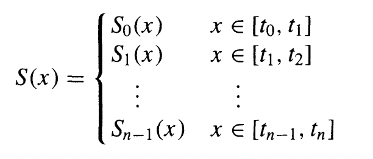
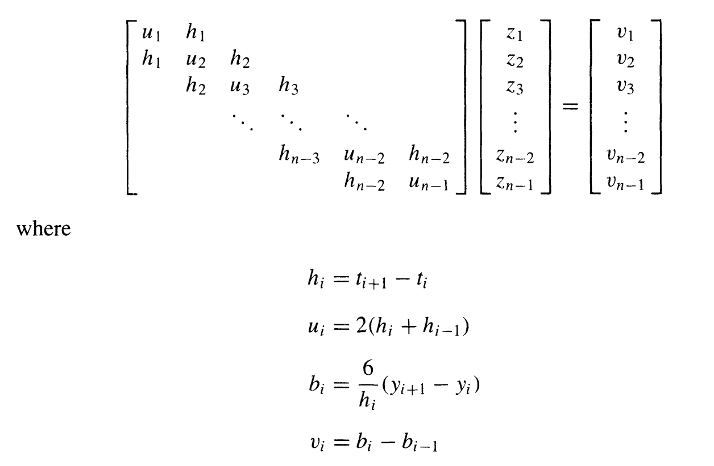
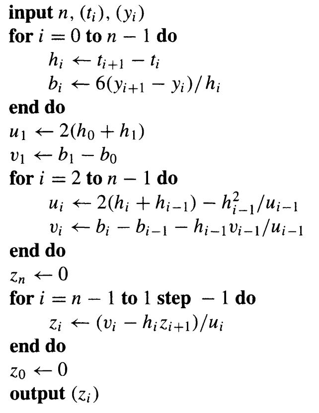
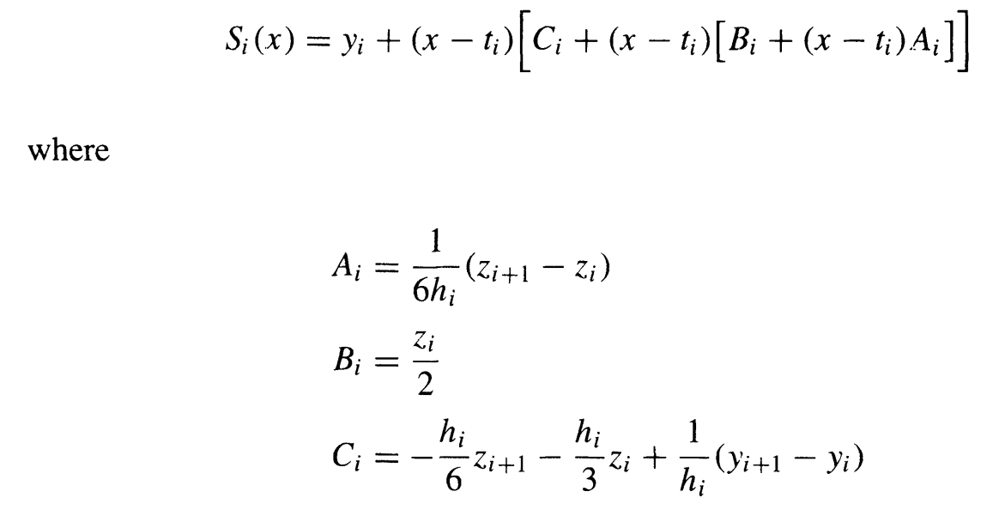
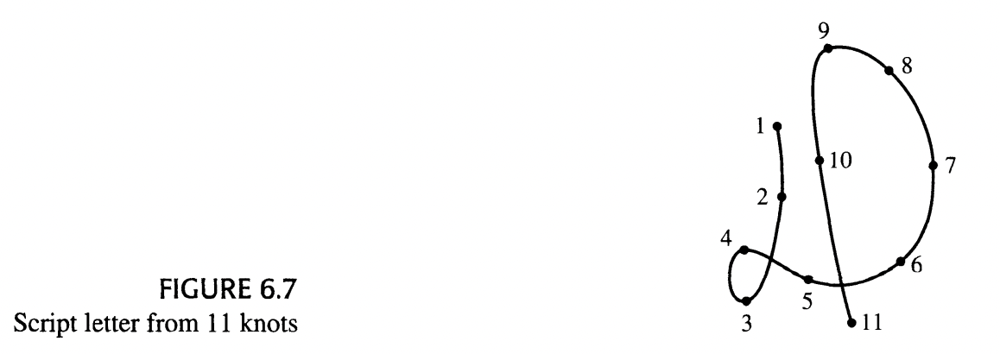
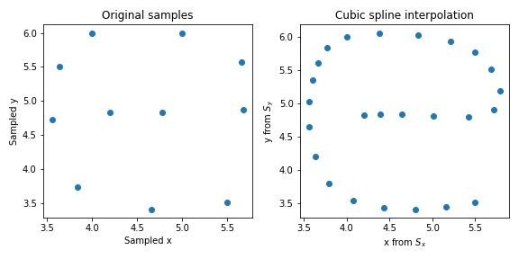
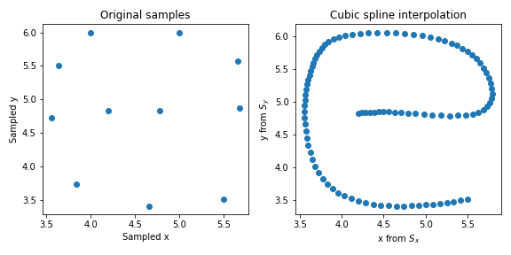
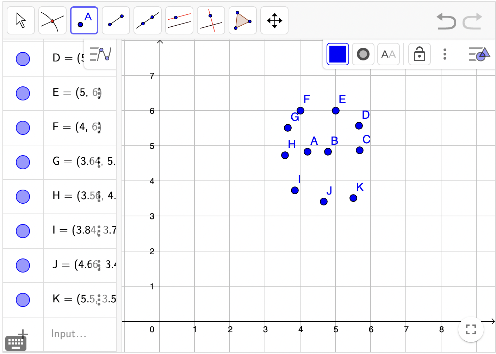
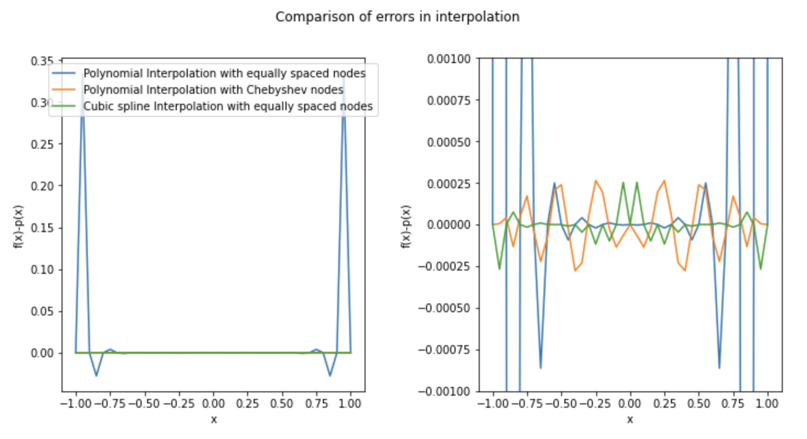

# Interpolation

## Overview

### Cubic Spline Interpolation 
Spline function consists of polynomial pieces on subintervals joined together with certain continuity conditions. $n+1$ points $t_0, t_1, ..., t_n$ are called knots. A spline function of degree $k$ having knots $t_0, t_1, ..., t_n$ is a function S such that :
1. On each interval $[t_{i-1}, t_i$, S is a polynomial of degree $\leq k$.
2. S has a continuous $(k-1)^{st}$ derivative on $[t_0, t_n]$.

In a cubic spline function S, each polynomial will of degree $\leq 3$. Given data $(t_i, y_i)$ for $0 \leq i \leq n$, we can compute the cubic spline interpolation given by,

by solving the system,

This can be solved using the algorithm,

after which we can compute $S_i(x)$ using,

### Polynomial Interpolation : Using Lagrange Polynomials
Given data $(x_i, y_i)$ for $0 \leq i \leq n$, there is one and only one interpolation polynomial of degree $\leq n$ associated with the data if $x_i$ are unique. There are different ways of expressing the interpolation polynomial. The Lagrange form of the interpolation polynomial is given by,
$$p(x) = \sum_{k=0}^n y_k \cdot l_k(x)$$
where $$l_k(x) = \prod\limits_{\substack{j=0 \\ j\neq i}}^n \frac{x-x_j}{x_i-x_j} \quad \quad 0 \leq i \leq n$$

## Getting started
Inorder to run the code for the following questions taken from *"David, K., & Ward, C.(2009). Numerical Analysis : Mathematics of scientific computing, third edition. American Mathematical Society"*, navigate to this directory (**/Newtons_Secant_Horners/**) and use the instructions that follow:

1. Section 6.4 Qn.7 : Draw a script letter, such as the one shown in Figure 6.7. Then reproduce it with the aid of cubic splines and a plotter. Proceed as follows: Select a modest number of points on the curve, say n = 11. Label these t = 1, 2,... , n. For each point, obtain the corresponding x- and y-coordinates. Then fit $x = S_x(t)$ and $y = S_y(t)$, using cubic spline interpolating functions $S_x$ and $S_y$. This will produce a parametric representation of the original curve. Compute a large number of values of $S_x(t)$ and $S_y(t)$ to give to the plotter. To learn more about how spline curves are used in designing typefaces, the reader should consult Knuth [1979]. 

           
           python Spline_Interpolation/Qn6_4__7.py
           
    e.g. output plot using 25 points 
    
    e.g. output plot using 100 points 

    Samples coordinates obtained using : [geogebra](https://www.geogebra.org/m/HmnV33gj)
    

2. Section 6.4 Qn.8 : Interpret the results of the following numerical experiment and draw some conclusions.

    a. Define p to be the polynomial of degree $20$ that interpolates the function $f(x) =(1 + 6x^2)^{-1}$ at $21$ equally spaced nodes in the interval $[—1, 1]$. Include the endpoints as nodes. Print a table of $f(x), p(x)$ and $f(x) — p(x)$ at $41$ equally spaced points on the interval.

    b. Repeat the experiment using the Chebyshev nodes given by $$x_i = cos[(i - 1)\pi/20] \quad \quad (1 < i < 21) $$

    c. With $21$ equally spaced knots, repeat the experiment using a cubic interpolating spline
           
           python Spline_Interpolation/Qn6_4__8.py
           
    Output : 
    
 Error stats :
    
|         | Polynomial Interpolation with equally spaced nodes | Polynomial Interpolation with Chebyshev nodes | Cubic spline Interpolation with equally spaced nodes |
|---------|----------------------------------------------------|-----------------------------------------------|------------------------------------------------------|
| Max     | 0.3342047779189009                                 | 0.00026438597925459995                        | 0.0002538117963474251                                |
| Min     | -0.027658387666702366                              | -0.0002772268698846281                        | -0.00026786718837179535                              |
| Mean    | 0.015116611260860295                               | -1.573236101873795e-07                        | -1.0598282896892778e-05                              |
| Std_dev | 0.07251251050940774                                | 0.00015180945290261418                        | 8.986271219774465e-05                                |
           

## References
*David, K., & Ward, C.(2009). Numerical Analysis : Mathematics of scientific computing, third edition. American Mathematical Society*
